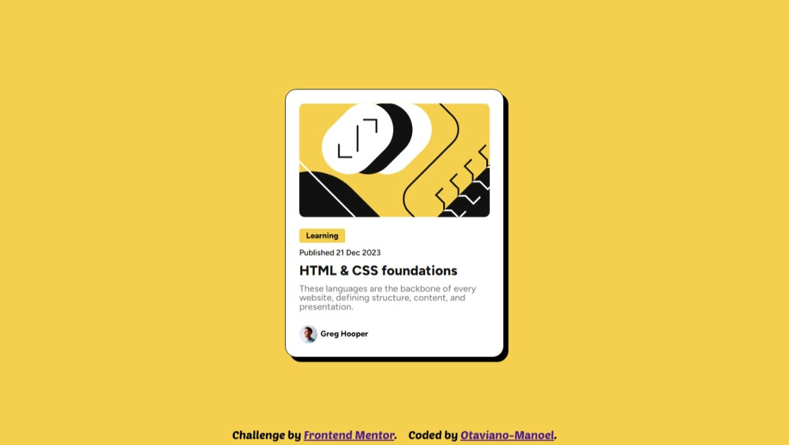

# Frontend Mentor - Blog preview card solution

This is a solution to the [Blog preview card challenge on Frontend Mentor](https://www.frontendmentor.io/challenges/blog-preview-card-ckPaj01IcS). Frontend Mentor challenges help you improve your coding skills by building realistic projects. 

## Table of contents

- [Overview](#overview)
  - [The challenge](#the-challenge)
  - [Screenshot](#screenshot)
  - [Links](#links)
- [My process](#my-process)
  - [Built with](#built-with)
  - [What I learned](#what-i-learned)
  - [Continued development](#continued-development)
  - [Useful resources](#useful-resources)
- [Author](#author)

## Overview

### The challenge

Users should be able to:

- See hover and focus states for all interactive elements on the page

### Screenshot

### Links

- Solution URL: [URL here](https://github.com/Otaviano-Manoel/blog-preview-card-main)
- Live Site URL: [URL here](https://otaviano-manoel.github.io/blog-preview-card-main/)

## My process

### Built with

    
    
    
    
    

### What I learned

1. **Technologies and Tools**:
   - **React**: Deepened my knowledge in React, particularly in creating functional components.
   - **TypeScript**: Learned to integrate TypeScript into a React application to improve typing and code safety.
   - **CSS Flexbox and Grid**: Enhanced my layout skills using Flexbox and Grid to create responsive and adaptable layouts.
   - **GitHub Pages**: Discovered how to deploy a React application using GitHub Pages, making it easy to view and share the project.

2. **Development Best Practices**:
   - **Code Organization**: Learned the importance of organizing code in a modular way, separating components and styles for easier maintenance.
   - **Componentization**: Practiced creating reusable and generic components that can be easily integrated into other projects.

3. **Challenges and Solutions**:
   - **Problem Solving**: Faced and solved various issues, from bugs in the code to responsive design challenges.
   - **Debugging**: Learned to use debugging tools like the browser's DevTools and console to identify and fix issues in the code.

4. **Development and Deployment**:
   - **Build and Deploy**: Understood the process of building a React application and how to set up scripts to automate deployment with `gh-pages`.
   - **Optimization**: Learned about performance optimization and how to reduce the size of build files to improve application loading speed.

5. **Feedback and Iteration**:
   - **User Feedback**: Learned the importance of collecting user feedback to iterate and continuously improve the project.
   - **Testing**: Understood the importance of testing to ensure the application works as expected in different scenarios.

### Continued development

This project is just the beginning of a long learning and improvement journey. I plan to continue developing and expanding its functionalities and capabilities. Here are some plans and ideas for future development:

- **New Features**: Add more interactive and dynamic components to enhance user experience.
- **UI Enhancements**: Refine design and usability following best design practices.
- **Performance Optimization**: Implement techniques to improve loading time and overall efficiency of the application.
- **Automated Testing**: Write unit and integration tests to ensure code robustness and reliability.
- **Documentation**: Improve code documentation and add usage guides to facilitate contribution from other developers.

### Useful resources

- [React Documentation](https://reactjs.org/docs/getting-started.html) - Official React documentation is an excellent resource for understanding how to use and develop with React.
- [Create React App Documentation](https://create-react-app.dev/docs/getting-started/) - Official guide to getting started with Create React App, one of the most popular ways to start a React project.
- [TypeScript Documentation](https://www.typescriptlang.org/docs/) - Official TypeScript documentation, useful for understanding how to use TypeScript in your React projects.
- [GitHub Pages Documentation](https://docs.github.com/en/pages) - Official guide to configuring and deploying websites using GitHub Pages.
- [gh-pages](https://www.npmjs.com/package/gh-pages) - npm package that simplifies deploying projects to GitHub Pages.
- [Flexbox Guide](https://css-tricks.com/snippets/css/a-guide-to-flexbox/) - Detailed guide on Flexbox in CSS, useful for layout and responsive design.
- [MDN Web Docs](https://developer.mozilla.org/) - One of the best sources to learn about HTML, CSS, and JavaScript.
- [Frontend Mentor](https://www.frontendmentor.io/) - Front-end project challenges to enhance your coding skills.
- [Google Fonts](https://fonts.google.com/) - A collection of free fonts that can be used in your web projects.

## Author

- Frontend Mentor - [@Otaviano-Manoel](https://www.frontendmentor.io/profile/Otaviano-Manoel)

